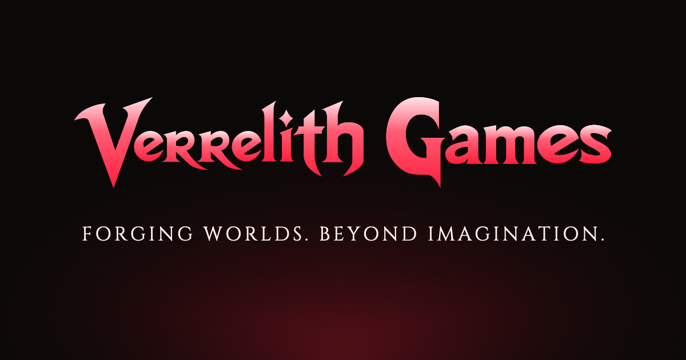

<!--
  VERRELITH GAMES — GitHub organization profile (public)
  Repo `.github` → profile/README.md · renders at https://github.com/Verrelith-Games

  Rebuilt 2026-09-24 to match the studio's forge branding: the studio banner,
  the crimson palette, and only facts the website already states (one-person
  studio, the six announced games, the Mark of Quality, launch in Fall 2028).
  Palette: Crimson #FF1F3D · Oxblood #7A0A18 · Void #0A0908 · Ash #A0A4AC ·
  Bone #FFF1EE · Molten Gold #FFA726 (rare accents only).
  HTML comments never render on GitHub.
-->

 

       

**The full site opens in Fall 2028.**

## Who we are

**A small, independent studio building worlds worth getting lost in.**

Verrelith Games pairs strong narrative foundations with systems-driven design, so the choices you make ripple outward — across science fiction, fantasy and horror. We treat players as collaborators, not consumers, and we build the kind of worlds we'd want to disappear into ourselves.

The studio is **one person**, founded in **2026**, working remotely from the United States.

## Our worlds

| Game | Universe | Site |
|:--|:--|:--|
| **Vitrexis** | Elderblade | [vitrexis.com](https://vitrexis.com) |
| **Elderblade** | Elderblade | [elderblade.com](https://elderblade.com) |
| **FREEDOM** | FREEDOM | [freedomsaga.com](https://freedomsaga.com) |
| **Vance Corvin** | Vance Corvin | [vancecorvin.com](https://vancecorvin.com) |
| **Ashen Requiem** | Ashen Requiem | [ashenrequiem.com](https://ashenrequiem.com) |
| **The Netheris Witch** | Elderblade | [netheriswitch.com](https://netheriswitch.com) |

Each game has its own site, where its details arrive as it is shown.

## What we stand for

- **Story-first, system-deep.** Cinematic arcs held up by expressive mechanics. The world reacts; the player shapes it.
- **Respect for your time.** Clear goals, meaningful progression, optional mastery. No dark patterns, no artificial grind.
- **Accessible by design.** Subtitles, comfort options, scalable UI and input flexibility as first-class features — never afterthoughts.
- **Ship when it's ready.** We'd rather miss a date than miss the mark. Quality is the gate.
- **Human-made.** Nothing generated or edited by an AI model reaches players — in the games or the marketing around them. That is the **[Verrelith Mark of Quality](https://verrelithgames.com/mark-of-quality)**, a published standard.
- **What we don't do:** live-service treadmills, procedural everything, or crunch as a milestone strategy.

## VITHRO UI

**[vithro.com](https://vithro.com)** — the studio's own interface language: one grammar of spacing, type, motion and state logic behind every Verrelith game, so players learn one system once and carry it everywhere. Every world gets its own light.

## Get in touch

| For | Write to |
|:--|:--|
| **Press & business** | [press@verrelithgames.com](mailto:press@verrelithgames.com) |
| **Help & support** | [support@verrelithgames.com](mailto:support@verrelithgames.com) |
| **Security reports** | [security@verrelithgames.com](mailto:security@verrelithgames.com) |

Every email is read by a person.

 

<i>Forging Worlds. Beyond Imagination.</i> 
© 2026 Verrelith Games, LLC. All rights reserved.

